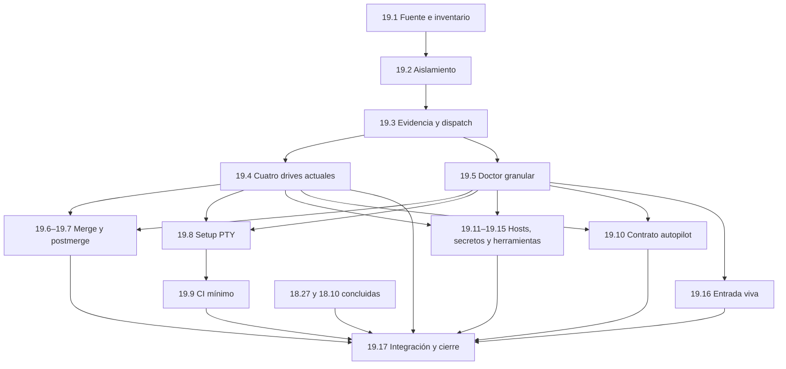

# Phase 19 — cerrar los gaps del feature map

Fecha: 2026-09-06 UTC. Plan solicitado por el operador con `harness-plan`.
**Estado: planificación; ninguna de las tareas siguientes está implementada.**

**Objetivo:** descubrir las superficies públicas del kit, conducir sus casos
declarados en aislamiento y conservar evidencia que distinga PASS, FAIL y unknown.
**Arquitectura:** extender la skill local con catálogo y descriptores por
feature, un runtime común de aislamiento/evidencia y drivers independientes.
**Stack:** bash existente, Python 3 estándar para datos/PTY, Git local y dobles
estrictos de transportes; CI actual de GitHub Actions.
**Spec:** [contrato del mapa](spec/feature-map.md), subordinado a
[spec del producto](spec/00-project-spec.md). Las filas de `Plans.md` son el
contrato de entrega; este documento explica sus pruebas y reparto.

## Estado observado y trabajo paralelo

- `git fetch origin` dejó `origin/master` en `99e8486c03c08b6fcd71d9645e9988e2de6cd39a`.
  Checkout principal en master; `.cursor/`, `.qwen/` y el traspaso son preexistentes
  sin seguimiento. Se preservan. Este plan usa worktree propio y rama
  `docs/feature-map-plan` desde ese ref.
- [PR #210](https://github.com/gon0801/summonaikit-claude/pull/210),
  `docs/18.10-cierre-documental`, draft en `8220e438`, tiene
  [gate verde](https://github.com/gon0801/summonaikit-claude/actions/runs/34017266996).
  Su propio cuerpo lo declara bloqueado por 18.27. Archivos: README, guía,
  spec de límites, retro y test de guía. Verde de CI no significa cierre de 18.10.
- 18.27: worktree `/private/tmp/saikit-fix1827-1788675753-42359`, rama
  `fix/grok-headless-recibo-1827`, modificación local del hook; no apareció PR
  suyo en la consulta de abiertos. Progreso posterior: no observado en esta foto.
- 18.26 está cerrada con límite de sello por sesión; 16.7 sigue opcional/no
  ejecutada. Ninguna fila existente cambia de estado por crear este plan.
- Antes de iniciar una fila, refrescar remoto, PRs y worktrees. El plan puede
  avanzar sin tocar las áreas de 18.27/18.10; 19.17 consume sus resultados.
  La modificación de spec en este PR se limita al contrato nuevo y dos
  excepciones de alcance; si hay conflicto al integrar #210, conservar ambos
  contenidos y sus límites, sin reformular su cierre.

## Investigación y decisiones

Fuentes locales: traspaso `docs/traspaso-feature-map-2026-09-06.md`, controlador
y siete archivos de la skill, `verify/`, `AGENTS.md`, `CLAUDE.md`, README,
spec, `Plans.md`, `docs/phase-16-18-recetario-autopilot-design.md`, tests y CI.
Se consultó `.claude/memory/session-log.md`: solo registra una sesión sin
cambios; las decisiones relevantes provienen del diseño D11/D18/D19/D23,
ledger y evidencia versionada. Búsqueda remota harness-mem: no disponible
como herramienta en esta sesión; no se leyó su base de datos ni perfiles vivos.
No se inspeccionó pstack ni se afirma paridad; este plan no necesita importar
dependencias ni contrastar nuevas APIs externas.

Hallazgos estáticos, no reproducciones ejecutadas:

| Hallazgo | Evidencia local | Consecuencia |
|---|---|---|
| Skill fuera de Git | `git ls-files .cursor/skills/verify-summonaikit` vacío | CI no puede protegerla hasta 19.1 |
| Gate solo mira encabezado/exit | controlador, `cmd_drive_gate_scenario` | Aserciones de estado/contrato propias en 19.4 |
| Fichas ya tienen H2 y Preconditions | cuatro fichas actuales | Añadir candado/triples, no vender secciones existentes como nuevas |
| `source` de estado y overrides heredados | `load_state`, `cleanup`, `HOME_REAL` | Aislamiento obligatorio 19.2 |
| HOME no contiene writes a cwd/Git | setup, merge y postmerge | Repos y origin locales por caso |
| Reintento pisa archivo y `set -e` corta reporte | nombres por `VERIFY_RUN_ID`, `rc=$?` después de comando | Intentos exclusivos y finalización 19.3 |
| Supuesto test de cinco respuestas usa flags | `test_autopilot_config.sh`; setup `[ -t 0 ]` | PTY auténtico 19.8 |
| Lint bash omite controlador sin extensión | `tests/lib/check_syntax.sh` busca `*.sh` | Lint explícito en 19.1 |
| Registro es advisory y exits nativos difieren | registration, golden, setup | Conservar tool_exit y evaluar observable por contrato |
| `.cursor` excluido por spec anterior | Non-Goals | Excepción solo para fuente de esta skill |

Alternativas evaluadas (puntuaciones de juicio, 1–5; no benchmarks):

| Alternativa | Encaje | Evidencia | Valor | Viabilidad | Regresión | Mantenimiento | Seguridad | Verificable | Decisión |
|---|---|---|---|---|---|---|---|---|---|
| Solo más fichas/drives sobre el controlador actual | 4 | 4 | 2 | 5 | 2 | 2 | 2 | 2 | Reject: perpetúa falsos verdes y escapes |
| Contrato común + extensión incremental de la skill | 5 | 4 | 5 | 4 | 4 | 5 | 4 | 5 | Required, propuesta elegida |
| Sustituir por pstack u otra plataforma | 2 | 1 | 2 | 2 | 2 | 2 | 2 | 2 | Reject: sin inspección ni necesidad medida |

Required: los siete gaps, aislamiento fundacional, inventario con exclusiones
y cobertura explícita de herramientas públicas adicionales locales.
Recommended: ampliaciones de combinaciones de flags/hosts tras medir demanda.
Optional: medición externa viva de `merge-happy-path`, con autorización nueva;
Required es mantener su entrada y ejecutor de precondiciones honestos.
Reject: sustituir `verify/`, importar pstack, adoptar Cursor, transferir sellos
entre sesiones, auto-merge/revert, barrer perfiles o añadir dependencias globales.

**Spec delta:** nueva [spec/feature-map.md](spec/feature-map.md); enlace en el
spec principal y excepción limitada a fuente de skill y worktrees independientes
de Phase 19. No cambia el gate del producto ni el lock autopilot.
`team_validation_mode: subagent`: tres investigadores de solo lectura cubrieron
Architecture; QA/Security; Product/Skeptic. Coincidieron en aislamiento primero,
separar tool_exit de resultado y limitar afirmaciones de cobertura. Se integran
sus hallazgos. La revisión final independiente pidió dos ajustes medios
(transición de ejecutores legacy y dependientes PTY) y uno menor (grafo).
Se incorporaron mediante revisión del líder; no hubo hallazgos altos ni segunda
ronda. El dictamen original fue REQUEST_CHANGES, no se presenta como APPROVE.
`formatter_baseline: configured`: higiene, JSON/YAML y secretos en
`.pre-commit-config.yaml`; sintaxis bash en `tests/lib/check_syntax.sh`.
19.1 añade el archivo sin extensión y validación Python de los nuevos helpers;
no reformat masivo ni instalador adicional de lint.

## Inventario inicial que 19.1 debe materializar

La tabla fija familias y casos mínimos; 19.1 contrasta los archivos descubiertos
con el árbol actualizado. Cada flag adicional se clasifica como cubierto o
caso diferido con razón. No se exige una feature por helper ni se declara
cobertura completa de todos los flags por probar un comando.

| ID de feature | Superficies | Casos mínimos / tarea |
|---|---|---|
| `install-guardian` | `tools/install-hook.sh`, manifiestos | dry-run sin writes, instalación, no-op, ajeno intacto, restauración / 19.4 |
| `gate-turn` | hook, `tools/golden-harness.sh` | unarmed y armed, contrato/estado/procedencia; Stop negativo por caso separado / 19.4 |
| `audit-ledger` | `tools/audita-ledger.sh` | repo limpio y trabajo mergeado con fila abierta / 19.4 |
| `check-deploy-log` | `tools/check-deploy-log.sh` | válido, mal orden, PR duplicado / 19.4 |
| `saikit-merge` | `tools/saikit-merge.sh` | listo, confirmado revalidado, rechazos y revert controlado, gh simulado / 19.6 |
| `saikit-postmerge` | `tools/saikit-postmerge.sh` | verde, rojo, pendiente/sin run, aviso sin revert, transportes simulados / 19.7 |
| `setup-autopilot` | `tools/saikit-setup-autopilot.sh`, skill wrapper | cinco preguntas PTY, flags, defaults, lock / 19.8 |
| `ci-minimo` | `tools/saikit-ci-minimo.sh` | oferta aceptada/rechazada, workflow existente, runners admitidos / 19.9 |
| `autopilot-contract` | contrato del hook, fixtures golden | sentinel, estado, párrafo que pide confirmación / 19.10 |
| `install-hosts` | install/registration, `hosts/`, `agents/`, `recetas/`, skills instaladas | cuatro copias de hook, zcode reusa Claude, perfiles kimi; registro textual / 19.11 |
| `routing-recipes` | `tools/model-routing.sh`, `tools/gen-recetas-manifest.sh` | rutas existentes por rol, manifiesto válido/alterado, consumidores / 19.11 |
| `check-secrets` | `tools/check-secrets.sh` | detector fuerte y fallback explícito; trampa sintética / 19.12 |
| `capture-payloads` | `tools/capture-payloads.sh` | registro/captura/retirada, cwd, permisos, solo payload sintético / 19.12 |
| `decision-blast` | `tools/saikit-decision.sh`, `tools/saikit-blast.sh` | rastro válido/rechazado y blast redactado/rechazado / 19.13 |
| `verify-app` | `skills/saikit-verificar-app/verificar.sh`, `verify/` | generar, rechazo sobre existente, estado vigente/desactualizado / 19.14 |
| `stage-override` | `tools/stage-override.sh` | staging y uso de fuente/estado aislados, ajeno intacto / 19.15 |
| `merge-happy-path` | recorrido vivo del operador | evaluador de precondiciones; bloqueo honesto por defecto / 19.16 |

Exclusiones iniciales obligatorias, verificadas por el catálogo:

- `tools/lib/{redactar,veredicto_contract,restaurar_desde_backup}.sh`:
  bibliotecas internas; cubiertas por consumidores, no ejecutores públicos.
- `tools/check_context_docs.py`: infraestructura de calidad ajena al recorrido
  del producto; conserva su propio gate.
- `tools/probe-zcode-output.sh`: diagnóstico especializado histórico, público
  pero fuera de esta ampliación. No lo cubre capture por delegación.
- `tools/hook-acl.ps1`: herramienta pública Windows/ACL; sigue existiendo,
  aunque se retiró su test. Cobertura no acreditada aquí; requiere otro entorno.
- Manifiestos, assets de perfiles/recetas y adaptadores no son comandos
  independientes: se asignan a instalación/contrato con casos declarados.
- `.cursor` restante, `.qwen`, `.run`, artefactos locales y credenciales no
  se incorporan. `verify/` se preserva y sí tiene correspondencia explícita.

## Entregas y dependencias

Cada fila es un PR revisable con su propio ciclo de regresión y mutación.
Los subpasos de configuración/documentación van con su comportamiento, sin
crear una tarea por archivo. No lanzar todos los drivers antes del contrato.

Solo un responsable modifica `scripts/control-summonaikit`, `scripts/lib/`,
esquemas y catálogo centrales en 19.1–19.3/19.5. Después, cada worker posee
su descriptor/ficha/driver/test; el descubrimiento por descriptor evita editar
el dispatcher por cada feature. Si necesitan cambiar una interfaz común, lo
entregan al responsable del núcleo antes de continuar. Worktrees separados,
máximo dos workers simultáneos en la primera ola; integración/merges seriales
por el líder. No altera el lock de un PR autopilot por repo.

### 19.1 — Fuente versionada, inventario y lint

Archivos: `.gitignore`, siete fuentes existentes de la skill,
`features/catalog.json`, `features/<id>.json`, `scripts/lint-feature-map.py`,
`.pre-commit-config.yaml`, `tests/test_feature_map_inventory.sh`.
Produce IDs, raíces, schema de descriptor y clasificación de todos los archivos.

- [ ] Copiar al worktree solo las siete fuentes permitidas del checkout local
  tras comparar sus hashes del apéndice; si cambian, revisar diff. Si faltan,
  reportar el insumo ausente; no reconstruirlo silenciosamente ni copiar `.run`.
- [ ] Escribir casos rojos: superficie nueva sin clasificación, ficha sin
  ejecutor, ejecutor huérfano, ID duplicado, H2 fuera de orden, triple incompleto,
  aserción sin caso y exclusión sin razón. Un helper interno clasificado pasa.
- [ ] Implementar catálogo y lint, comprobar sintaxis del controlador sin
  extensión y helpers Python; preservar modos de archivo. El catálogo enumera
  futuros drivers como pendientes con tarea dueña; no finge ejecutores existentes.
  El candado de huérfanos exige ejecutor para las features activas y para una
  feature bloqueada ya entregada; una tarea futura aún no es feature activa.
  Para las cuatro existentes, usar `executor.kind: legacy` con comando/función
  validados contra el controlador actual, no rutas de driver inexistentes.
  19.3 conserva ese adaptador y 19.4 lo sustituye por drivers independientes.
- [ ] Mutaciones: omitir descubrimiento, aceptar huérfano, quitar chequeo de
  orden/triples y aceptar JSON mal formado; cada mutante tiene caso rojo.

### 19.2 — Runtime aislado obligatorio

Archivos: controlador, `scripts/lib/runtime.sh`, `scripts/lib/state.py`,
`tests/test_feature_map_isolation.sh`, instrucciones de migración de la skill.
Consume catálogo. Produce estado declarativo validado, entorno/cwd privados y
precondición obligatoria usada por todos los comandos, incluidos aliases y cli.

- [ ] Rojo: estado con comando incrustado, espacios, JSON truncado, symlink,
  `..`, HOME_REAL adulterado, override host/Git/transport heredado, cwd real,
  ruta de artifacts ajena, cleanup sobre temporal no propio y dos launches.
- [ ] Aislar HOME y Git por caso; preparar hook por dependencia. Restringir cli
  a entradas/argumentos permitidos y emitir migración para `.run/env` antiguo.
- [ ] Verificar sentinelas externos sintéticos byte a byte antes/después de
  launch/drive/cli/cleanup. No consultar archivos reales del operador.
- [ ] Mutar por separado guard físico, saneamiento de entorno, cwd y ownership
  de cleanup; cada escape debe ponerse rojo en un caso identificado.

### 19.3 — Evidencia común, intentos y dispatch

Archivos: controlador, `scripts/lib/evidence.py`,
`schemas/{step,summary,doctor}.schema.json`, `tests/test_feature_map_evidence.sh`,
`tests/test_feature_map_dispatch.sh`. Consume runtime/descriptores; produce
`list-features`, `drive <id>`, aliases y formato v1 del spec.

- [ ] Rojo: rc inesperado, fallo antes de `rc=$?`, intento repetido/concurrente,
  interrupción, pasos vacíos, aserción omitida, conteos falsos, summary/exit
  incoherente, FAIL degradado a unknown, rechazo esperado bien observado.
- [ ] Escribir antes de ejecutar, recoger exit en rama controlada y finalizar
  evidencia redactada sin perder rojo. ID exclusivo, summary derivado/validado.
  Registrar tool_exit nativo; no imponer conversión global de códigos.
- [ ] Probar dispatcher con ejecutores sintéticos que pasan/fallan/no observan;
  aliases de caso declaran su alcance parcial. Precondición bloqueada no es PASS.
- [ ] Mutar cada regla del schema y agregación; inyectar secreto sintético en
  argv/stdout/stderr y probar todos los artefactos. Reintento+cleanup preservan
  hashes y directorio del intento rojo anterior.

### 19.4 — Aserciones reales de las cuatro features actuales

Archivos: `scripts/drivers/{install-guardian,gate-turn,audit-ledger,check-deploy-log}.sh`,
sus cuatro fichas/descriptores y `tests/test_feature_map_existing.sh`.
Consume runtime/evidencia; usa las herramientas reales sobre fixtures locales.

- [ ] Reutilizar criterios de `verify/test_drive.py`, no sustituir el driver
  por una invocación de esa suite: SHA de hook, escenarios/pasos exactos,
  unarmed sin contrato/estado, armed con JSON/contrato/estado correctos.
- [ ] Añadir Stop armado sin recibo y rechazo observado si se declara en ficha;
  no atribuir ese comportamiento a los escenarios 01/02.
- [ ] Instalar en sandbox: dry-run sin delta, identidad fuente, no-op, ajeno
  intacto y restore sobre fixture vendor conocido. Ledger y deploy-log: fixture
  válido y negativo con razón concreta, no solo encabezado/exit.
- [ ] Mutaciones: quitar cada aserción requerida, escribir en dry-run, omitir
  contrato/estado, aceptar ledger atrasado o PR duplicado. Un encabezado falso
  con rc 0 jamás satisface los casos de conducta.

### 19.5 — Doctor por feature

Archivos: `scripts/lib/doctor.py`, controlador, requisitos de descriptores,
`tests/test_feature_map_doctor.sh`. Consume schema v1/runtime; produce
`doctor [id]` y `doctor.json` con requisitos, disponibilidad y razones.

- [ ] Rojo: falta gh solo afecta live; falta PTY afecta los casos interactivos
  de setup y CI mínimo, conservando flags/defaults observables; fixture corrupto
  es FAIL, dependencia ausente es unknown/MISSING, escape bloquea todo.
- [ ] No leer perfiles reales para comprobar instalación; preparar fixtures
  solo mediante runtime. Doctor no consume cuota para probar disponibilidad.
- [ ] Mutaciones: hacer global una falta local, presentar BLOCKED como PASS,
  aceptar gh falso como acceso vivo y omitir guard de aislamiento.

### 19.6 — Merge y revert controlado, con GitHub simulado

Archivos: driver/ficha/descriptor `saikit-merge`,
`tests/test_feature_map_merge.sh`, fixtures dedicados. Base:
`tests/test_saikit_merge.sh`; el drive llama `tools/saikit-merge.sh` real.

- [ ] Git y origin bare locales, gh falso estricto que registra argv.
- [ ] Casos: LISTO sin merge; confirmado revalida SHA/CI/sello; CI rojo, base
  movida, sello ajeno y head cambiado impiden llamada de merge. `--revert-de`
  respeta punta/trailer del fixture y no autoriza otras ramas.
- [ ] Afirmar `--match-head-commit` del head correcto, sin `--admin` ni
  `--delete-branch`; mutar cada protección. Modo siempre `simulated`.

### 19.7 — Postmerge sin acciones remotas reales

Archivos: driver/ficha/descriptor `saikit-postmerge`,
`tests/test_feature_map_postmerge.sh`; base `tests/test_saikit_postmerge.sh`.

- [ ] Git/origin locales y gh/curl/telegram falsos; cada llamada no prevista
  falla. Verde, rojo, pendiente y sin run conservan su semántica nativa.
- [ ] Rojo reporta comando de revert válido sin ejecutarlo; HEAD/worktree
  permanecen intactos. Aviso redactado y sin envío real.
- [ ] Mutar revert automático, aceptación de CI rojo, texto de revert,
  redacción y uso de transporte heredado; cada caso detecta su mutante.

### 19.8 — Las cinco preguntas de setup por PTY

Archivos: driver/ficha/descriptor `setup-autopilot`, `scripts/lib/pty_driver.py`,
`tests/test_feature_map_setup.sh`; base `tests/test_autopilot_config.sh`.

- [ ] Python stdlib PTY con timeout finito y kill/reap del grupo propio;
  transcript redactado prueba que aparecieron las cinco preguntas en orden.
- [ ] Responder valores distintivos y cotejar cada uno con config; cubrir
  respuesta inválida/timeout sin escritura parcial ni lock huérfano.
- [ ] Separar casos flags y defaults sin TTY. Un pipe no vale como prueba de
  interacción. Repos con/sin CI evitan confundir preguntas de setup y oferta CI.
- [ ] Mutar cada pregunta/mapeo, default, guard del lock y limpieza del timeout;
  PTY no disponible produce unknown en los casos interactivos de esta feature
  y de CI mínimo, nunca simulación presentada como PTY.

### 19.9 — CI mínimo generado

Archivos: driver/ficha/descriptor `ci-minimo`, `tests/test_feature_map_ci_minimo.sh`;
base `tests/test_ci_minimo.sh`. No cambia pins ni arregla su deuda histórica.

- [ ] Cubrir oferta aceptada/rechazada mediante PTY ya entregado, workflow
  existente intacto, runners admitidos y runner no soportado declarado.
- [ ] Afirmar YAML, actions fijadas y comandos reales de test y `verify/`,
  ejecutar esos comandos en fixture sin invocar Actions ni descargar paquetes.
- [ ] Mutar no-op indebido, omisión de verify/test, pin y sobrescritura ajena.
  Declarar que generación/ejecución local no acredita Actions vivo.

### 19.10 — Párrafo y estado autopilot

Archivos: driver/ficha/descriptor `autopilot-contract`,
`tests/test_feature_map_autopilot.sh`; consumir golden/fixtures actuales.

- [ ] Sentinel exacto arma full y `autopilot=1`; sin él no se hereda autopilot.
  Párrafo prepara y pide confirmación; no promete merge/revert desatendidos.
- [ ] Mutaciones por observación: sentinel, estado, párrafo y persistencia.
  Si el fuente vigente necesita corrección de producto, abrir defecto separado;
  el driver no cambia hook/golden para fabricar conformidad.

### 19.11 — Instalación/registro de hosts y ruteo/recetario

Archivos: drivers/fichas/descriptores `install-hosts`, `routing-recipes`,
`tests/test_feature_map_hosts.sh`. Bases: tests de install, provenance,
registration, model-routing y recetas.

- [ ] Cuatro hooks claude/grok/dsh/codex dentro del sandbox; zcode reusa
  Claude y kimi publica perfiles, sin inventarles otra copia de hook.
- [ ] Propiedad, identidad/no-op, registros y retirada preservando vecinos;
  fuente/procedencia conocida según fixture Git. Registration se juzga por
  diagnóstico y estructura, nunca solo exit 0. Casos host/OS no disponibles
  quedan explícitos y no invalidan los otros hosts observados.
- [ ] Ruteo por roles ya soportados, manifiesto/receta alterados y consumo del
  recetario; no implementar Optional 16.7. Prueba de instalación no equivale
  a turno vivo del modelo ni a carga del adaptador por dsh.
- [ ] Mutar destino host, fase omitida, no-op, ajeno, symlink y hash/ruteo;
  conservar evidencias por caso/host para no esconder cobertura parcial.

### 19.12 — Secretos y captura sintética

Archivos: drivers/fichas/descriptores `check-secrets`, `capture-payloads`,
`tests/test_feature_map_secrets_capture.sh`; bases tests homónimos existentes.
Integración CI de esta fila: `.github/workflows/quality.yml`, instalación del
detector fuerte en el job que corre estos casos, con versión/hash verificados
igual que el job secrets. Tenerlo en otro job no lo hace disponible en suite.

- [ ] Detector fuerte disponible: limpio y trampa; si solo hay fallback,
  afirmar su aviso y límite, dejando unknown la aserción del detector fuerte.
- [ ] Captura con config de host ficticia: instalar, alimentar payload
  sintético, comprobar cwd/permisos y quitar preservando ajenos.
- [ ] Rojo con secreto sintético en salida/URL/campo; cero coincidencias en
  evidencias conservadas. No cargar capturas reales para probar redacción.
- [ ] Mutar redacción, aviso fallback, permisos, filtro de cwd y conservación
  de configuración ajena. GitHub/token/Telegram reales fuera del entorno.

### 19.13 — Rastro de decisiones y blast

Archivos: driver/ficha/descriptor `decision-blast`,
`tests/test_feature_map_trace.sh`; bases `test_saikit_decision.sh` y
`test_blast_artifact_contract.sh`.

- [ ] Invocar tools reales sobre repo privado; rastro válido, fila inválida,
  blast válido y nivel/comando inválidos, redacción y archivo de salida correcto.
- [ ] Mutar cada rechazo y redacción; no duplicar toda la batería de carreras
  de las libs ni afirmar que los agentes escribirán estos artefactos solos.

### 19.14 — Generación/estado del mapa español

Archivos: driver/ficha/descriptor `verify-app`, `tests/test_feature_map_verify_app.sh`.
Base `tests/test_verificar_app.sh`; preservar `verify/` existente.

- [ ] Generar `verify/` solo en fixture nuevo; volver a generar rechaza y deja
  sus archivos intactos. `estado` diferencia sello vigente y deriva observada.
- [ ] Mutar rechazo, comparación de sello y referencia al comando Drive.
  No refrescar el sello del checkout sin ejecutar su Drive real al cierre.

### 19.15 — Staging por override

Archivos: driver/ficha/descriptor `stage-override`,
`tests/test_feature_map_staging.sh`; base `tests/test_stage_override.sh`.

- [ ] Preparar override en fixture; ejecutar hook esperado por su hash y
  comprobar que el estado quedó en el lab. Perfil externo sintético intacto.
- [ ] Mutar destino del hook/estado y guard de propiedad; verificar cleanup
  propio. No instalar override ni trust en una sesión viva del operador.

### 19.16 — Entrada viva con bloqueo honesto

Archivos: driver/ficha/descriptor `merge-happy-path`,
`tests/test_feature_map_live_preconditions.sh`.

- [ ] Sin permiso vigente/destino concreto: unknown/BLOCKED y ninguna llamada
  externa. Con dependencias falsas faltantes: razones específicas y actuales.
- [ ] Definir un procedimiento manual de medición con repo descartable,
  identificación topic+marcador, host, costo/cuota, SHA/PR y captura redactada.
  Preparar el procedimiento no autoriza ejecutarlo.
- [ ] Mutar permiso faltante a PASS, gh falso a vivo y sello hijo a padre por
  mtime/verified; rechazo observado en cada caso. La simulación nunca llena
  la aserción de merge vivo. No construir un bypass para el límite de 18.26.

### 19.17 — Integración, mantenimiento y cierre honesto

Archivos: catálogo/índice/SKILL de la skill, `tests/test_feature_map_integration.sh`,
documentación de límites de esta fase; `verify/` solo con evidencia nueva real.
Depende de 19.1–19.16 y de conclusiones integradas de 18.27/18.10.

- [ ] Checklist descubre todos los archivos declarados; no quedan entradas
  pendientes de implementación ni ejecutores legacy en catálogo. Cada exclusión tiene razón; cada
  feature activa/bloqueada posee ejecutor y aserciones mínimas trazables.
- [ ] Ejecutar los drives locales declarados en sandbox, aliases y combinación
  doctor→drive→reintento→cleanup. Comprobar evidencia FAIL y unknown, además de
  verde; insertar una superficie pública nueva rompe el candado.
- [ ] Conservar `verify/`, correr `pytest verify/` con fuente/env aislados y
  cotejar su resultado; no trasladar el PASS de la skill al sello por inferencia.
- [ ] Integrar resultado de 18.27, límite 18.26 y cierre 18.10 en fichas. Si el
  vivo queda bloqueado, reportar «inventariado; no observado», sin «todo probado».
- [ ] PR con CI `gate` verde y evidencia de cada protección. El líder cierra
  filas tras merge; despliega/verifica las cuatro copias, registra deploy-log
  incluso no-op y audita ledger, conforme a AGENTS.md. Workers no mergean.

## Verificación aplicable a cada entrega

Los nombres `tests/test_feature_map_*.sh` anteriores son archivos **a crear**;
no se afirma que existan ni que ya hayan corrido. Cada protección se implementa
con esta secuencia; los casos y mutantes exactos están en su fila detallada:

1. Escribir un caso rojo observable antes del fix/driver; guardar salida real.
2. Correr solo el archivo correspondiente con HOME/TMPDIR/USERPROFILE aislados
   y `SAIKIT_HOOK_VIVO` apuntando a la fuente del worktree, como exige AGENTS.md.
3. Implementar y volver a correr ese archivo. No usar `tests/run.sh` local
   para rojo/verde ni medir el hook instalado.
4. Ejecutar mutaciones acotadas de cada protección. Para drivers nuevos,
   mutar una copia del driver en sandbox y demostrar qué caso falla; no añadir
   mutantes del controlador a la batería del hook. Si hay líneas del hook
   tocadas en una tarea separada, seleccionar `SAIKIT_MUTACIONES` aplicables.
5. Ejecutar pre-commit sobre archivos tocados durante iteración y
   `pre-commit run --all-files` al final. No `--no-verify`.
6. Revisión cruzada: una ronda; segunda solo ante severidad alta, nunca tercera.
   Declarar residuales en PR. Rama desde origin/master actualizado y
   `git log origin/master..HEAD` solo con commits de esa entrega.
7. Push y **abrir PR**: Quality corre en PR, no en push de rama de feature.
   Batería completa una vez en CI: `suite` rápido + tres shards `suite-lentos`,
   más quality/node-adapter/secrets y su agregado `gate`. No crear job nuevo
   sin agregarlo al gate. Los wrappers se descubren automáticamente en rápido.

Los tests nuevos fijan STATE/ARTIFACTS y todo output fuera del checkout;
`.gitignore` no basta para que `tests/run.sh` deje de detectar fugas.
Linux CI debe ejecutar PTY y dependencias obligatorias; un skip o unknown de
un caso exigido impide cerrar esa cobertura. macOS/MSYS conservan límites por
caso, sin fingir que Linux acredita normalización Windows o ACLs.

## Operaciones y autorización

Esta solicitud autoriza preparar el plan. Los pushes/PR y lecturas de CI para
validarlo están cubiertos por las reglas de sesión; la implementación de las
filas se inicia con una orden posterior. No hay lectura de secretos prevista.

| Operación prevista | Razón y alcance | Situación |
|---|---|---|
| `git fetch`, rama/worktree, commit, push y PR en este repo | Entregar plan y validar CI; luego entregar cada tarea | Flujo de entrega ya autorizado por reglas de sesión |
| Lecturas `gh pr view/list`, `gh run view` | Estado actual y evidencia de gate | Lectura autorizada |
| Escrituras/borrado en sandbox propio | Probar tools sin tocar operador, 19.2–19.17 | Parte de la ejecución de tareas, con runtime validado |
| Merge/deploy en repo/perfiles del operador | Protocolo del líder tras aceptación | No se ejecuta al planificar ni por workers |
| Hosts vivos, GitHub descartable, cuota, merge/revert/delete o Telegram | Medición Optional de 19.16 | Requiere autorización nueva y concreta; no se solicita ni se ejecuta aquí |

No se escriben permisos ficticios a `.claude/state/plan-preapprovals.json`.
El log histórico de Phase 18 no es permiso para otra medición externa.

## Insumos locales para 19.1

Origen al planificar: `/Users/dn/dev/summonaikit-claude/.cursor/skills/verify-summonaikit/`.
Estos siete archivos todavía no viajan en Git; el líder debe entregarlos a la
primera tarea desde ese origen preservado. La lista/hashes acota el traspaso;
no autoriza copiar artefactos ni todo `.cursor/`.

| Ruta relativa a la skill | SHA256 observado |
|---|---|
| `SKILL.md` | `0d1d60cb9023059f463f24e25cfe4efa6a8024e56439a0755a7c742c0b1b38aa` |
| `features/README.md` | `43ab472070aa29cb9cfeb53024fc8d599939749f44cb174c04897635c7b3a4d9` |
| `features/audit-ledger.md` | `ca1e3cc8bf9cc64f2fcbaedf5503fa0b8a27c38acbf6afc8c3fff7c5bca81e79` |
| `features/check-deploy-log.md` | `1c3972ae35ca941e83d5e68e87a41c05027e7e793acef9c54d37d715905e527d` |
| `features/gate-turn.md` | `5c4ee591112fa3a3c633f234893bfa4268c3bb248405431cca08a895f1d23dc7` |
| `features/install-guardian.md` | `2d07bcd8cf13786290bb190f85cfb248e934f961dc2bb55a8ce07ab7f53b188a` |
| `scripts/control-summonaikit` | `27de01d4e50740710c97e312e47fed1075166de7afda40efebe496d9edeb55de` |

## Cómo iniciar la implementación

Nueva sesión: `claude` dentro del worktree de la primera tarea.
Primer mensaje: `/harness-work 19.1` y referencia a este plan/spec; entregar
antes las siete fuentes locales y partir de origin/master con el plan integrado.
Conviene comenzar solo con 19.1; los grupos paralelos dependen del runtime y
del contrato de evidencia. También se puede dar la misma orden en Codex.
